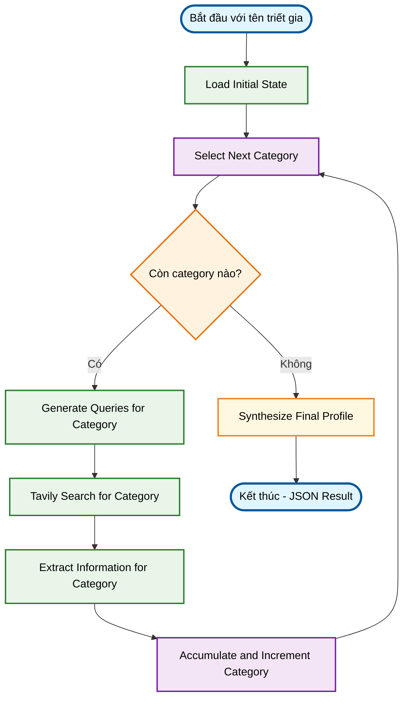
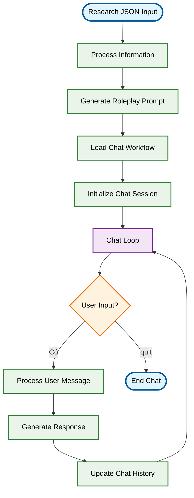

# Deep Researcher Agent + Chat Agent - Philosopher AI System 🧠💬

Một hệ thống AI Agent tiên tiến kết hợp **Deep Research Agent** và **Chat Agent** để nghiên cứu toàn diện các triết gia và sau đó trò chuyện trực tiếp với họ. Hệ thống sử dụng LangGraph, Groq/OpenRouter LLM, và Tavily Search để tạo ra trải nghiệm học tập triết học tương tác hoàn toàn mới.

## ✨ Tính năng chính

### 🔍 Deep Research Agent
- **Nghiên cứu tự động**: Chỉ cần tên triết gia, agent tự động xác định các khía cạnh cần nghiên cứu
- **Tìm kiếm thông minh**: Tự động tạo và thực hiện các truy vấn tìm kiếm tối ưu dựa trên 8 hạng mục nghiên cứu triết học
- **Trích xuất thông tin có cấu trúc**: Phân tích và tổ chức thông tin từ nhiều nguồn
- **Tổng hợp tri thức**: Tạo ra hồ sơ triết gia toàn diện và mạch lạc

### 💬 Chat Agent  
- **Trò chuyện thực tế**: Chuyển đổi hồ sơ nghiên cứu thành chatbot triết gia có tính cách riêng
- **Roleplay thông minh**: Agent tự tạo prompt roleplay dựa trên thông tin đã nghiên cứu
- **Lịch sử cuộc trò chuyện**: Duy trì ngữ cảnh và tính nhất quán trong cuộc trò chuyện
- **Phong cách đặc trưng**: Mô phỏng phong cách lập luận và ngôn ngữ của từng triết gia

### 🌐 Giao diện đa dạng
- **Streamlit Web App**: Giao diện web hiện đại, thân thiện với người dùng
- **Command Line Interface**: Cho những ai thích sử dụng terminal
- **Xử lý đa ngôn ngữ**: Hỗ trợ tiếng Việt và tiếng Anh
- **Lưu trữ kết quả**: Xuất báo cáo dưới định dạng JSON

## 🏗️ Cấu trúc dự án

```
philosopher_research_project/
├── .env                          # File biến môi trường (tạo từ .env_example)
├── requirements.txt              # Danh sách thư viện cần thiết
├── main.py                       # Ứng dụng Streamlit chính
├── README.md                     # Hướng dẫn sử dụng
├── research_*.json              # Kết quả nghiên cứu mẫu (Karl Marx, Wittgenstein, Socrates)
│
├── research_agent/              # Package Research Agent
│   ├── __init__.py             # Khởi tạo package
│   ├── state.py                # Định nghĩa state structure và 8 categories
│   ├── llm_services.py         # Cấu hình LLM (OpenRouter/Groq)
│   ├── tool_services.py        # Cấu hình tools (Tavily Search)
│   ├── nodes.py                # Logic chi tiết cho từng node (443 dòng)
│   └── graph.py                # Định nghĩa LangGraph workflow
│
├── chatAgent/                   # Package Chat Agent
│   ├── __init__.py             # Khởi tạo package
│   ├── main_chat.py            # CLI interface cho chat agent
│   ├── chat_state.py           # State management cho chat
│   ├── chat_graph.py           # LangGraph workflow cho chat
│   ├── chat_nodes.py           # Nodes logic cho chat workflow
│   ├── chat_llm_services.py    # LLM config cho chat
│   ├── chat_prompt_loader.py   # Load roleplay prompt từ file
│   ├── processInformation.py   # Xử lý thông tin nghiên cứu thành roleplay prompt
│   └── prompt.py               # File chứa roleplay prompt được tạo tự động
│
└── .venv/                       # Virtual environment
    __pycache__/                 # Python cache files
    .git/                        # Git repository
    chat_checkpoints.sqlite*     # LangGraph chat history database
```

## 🚀 Cài đặt và Thiết lập

### 1. Clone repository và cài đặt dependencies

```bash
# Clone repository (nếu có)
git clone <repository-url>
cd philosopher-ai-system

# Tạo virtual environment (khuyến khích)
python -m venv .venv
source .venv/bin/activate  # Linux/Mac
# hoặc
.venv\Scripts\activate     # Windows

# Cài đặt dependencies
pip install -r requirements.txt
```

### 2. Thiết lập API Keys

Tạo file `.env` với nội dung sau:

```env
# API Keys - BẮT BUỘC
GROQ_API_KEY="your_groq_api_key_here"
TAVILY_API_KEY="your_tavily_api_key_here"

# TÙY CHỌN: OpenRouter (nếu muốn dùng thay cho Groq)
OPENROUTER_API_KEY="your_openrouter_api_key_here" 

# TÙY CHỌN: Chỉ định model cụ thể
GROQ_MODEL_NAME="mixtral-8x7b-32768"
# OPENROUTER_MODEL_NAME="anthropic/claude-3-haiku"
```

#### 📋 Hướng dẫn lấy API Keys:

**🤖 Groq API Key** (MIỄN PHÍ - Khuyến khích):
1. Truy cập [GroqCloud Console](https://console.groq.com/keys)
2. Đăng ký/đăng nhập tài khoản
3. Tạo API key mới
4. Copy và paste vào file `.env`

**🔍 Tavily API Key** (MIỄN PHÍ tier có sẵn):
1. Truy cập [Tavily.com](https://tavily.com/)  
2. Đăng ký tài khoản và tạo API key
3. Copy và paste vào file `.env`

**🌐 OpenRouter API Key** (Tùy chọn):
1. Truy cập [OpenRouter.ai](https://openrouter.ai/)
2. Đăng ký và tạo API key (cần thanh toán cho một số model)

### 3. Kiểm tra cài đặt

```bash
# Kiểm tra dependencies
python -c "import langchain, langgraph, streamlit; print('Dependencies OK')"

# Kiểm tra API keys
python -c "from dotenv import load_dotenv; import os; load_dotenv(); print('Groq:', bool(os.getenv('GROQ_API_KEY'))); print('Tavily:', bool(os.getenv('TAVILY_API_KEY')))"
```

## 🎮 Cách sử dụng

### 🌐 Phương pháp 1: Streamlit Web App (Khuyến khích)

```bash
streamlit run main.py
```

Sau đó mở trình duyệt tại `http://localhost:8501`

**Giao diện web bao gồm 2 tab:**

1. **🔍 Deep Research Agent**: 
   - Nhập tên triết gia (VD: "Plato", "Immanuel Kant", "Friedrich Nietzsche")
   - Bấm "Start Research" 
   - Xem kết quả nghiên cứu theo 8 hạng mục
   - Download file JSON kết quả

2. **💬 Chat With Philosopher**:
   - Sau khi research xong, bấm "Start Chat with this Philosopher"
   - Hoặc upload file JSON research có sẵn 
   - Trò chuyện trực tiếp với triết gia

### 🖥️ Phương pháp 2: Command Line Interface

**Research Agent:**
```bash
# Chạy research từ terminal (cần tùy chỉnh code)
python -c "
from research_agent.graph import get_default_research_graph
import json
graph = get_default_research_graph()
result = graph.invoke({'philosopher_name': 'Socrates'})
print(json.dumps(result, indent=2, ensure_ascii=False))
"
```

**Chat Agent:**  
```bash
# Chạy chat CLI (cần có file prompt.py đã được tạo)
python chatAgent/main_chat.py
```

## 📊 8 Hạng mục nghiên cứu

Agent sẽ tự động nghiên cứu triết gia theo 8 hạng mục chi tiết:

1. **📖 Thông tin Tiểu sử và Bối cảnh Lịch sử - Văn hóa**
   - Tiểu sử cá nhân, nơi sinh, thời đại
   - Bối cảnh lịch sử, văn hóa, chính trị
   - Môi trường học thuật và ảnh hưởng sớm

2. **�� Các Tác phẩm Chính và Nội dung Cốt lõi**
   - Danh sách tác phẩm quan trọng
   - Nội dung và mục tiêu chính của từng tác phẩm
   - Bối cảnh xuất bản và đóng góp độc đáo

3. **🧠 Học thuyết và Tư tưởng Triết học Cốt lõi**
   - Khái niệm triết học trung tâm
   - Luận điểm và luận cứ chính
   - Hệ thống triết học tổng thể

4. **🎯 Quan điểm về các Chủ đề Triết học Cụ thể**
   - Thực tại và siêu hình học
   - Tri thức luận và phương pháp luận
   - Đạo đức học và triết học chính trị
   - Thẩm mỹ học và các lĩnh vực khác

5. **🤝 Mối quan hệ và Tương tác Triết học**
   - Triết gia ảnh hưởng đến họ
   - Triết gia họ ảnh hưởng đến
   - Cuộc tranh luận và đối thoại quan trọng

6. **⚖️ Phê bình và Đánh giá Học thuyết**
   - Những chỉ trích chính đối với học thuyết
   - Điểm mạnh và điểm yếu được xác định
   - Phản bác và biện hộ

7. **🔬 Phương pháp Triết học Đặc trưng**
   - Cách tiếp cận nghiên cứu triết học
   - Phương pháp luận đặc trưng
   - Phong cách lập luận riêng biệt

8. **✍️ Phong cách Lập luận và Văn phong**
   - Hình thức trình bày (đối thoại, luận văn, etc.)
   - Đặc điểm tu từ học
   - Loại bằng chứng và lý luận sử dụng

## 🔧 Workflow chi tiết

### 🔍 Research Agent Workflow



### 💬 Chat Agent Workflow



## 📁 Kết quả và file output

### Research Results (JSON format)
```json
{
  "philosopher_name": "Plato",
  "final_synthesized_profile": {
    "Biographical_Historical_Context": {...},
    "Major_Works_Core_Content": {...},
    "Core_Philosophical_Doctrines_Ideas": {...},
    "Views_on_Specific_Philosophical_Topics": {...},
    "Philosophical_Relationships_Interactions": {...},
    "Critiques_Evaluations_of_Doctrines": {...},
    "Characteristic_Philosophical_Methodology": {...},
    "Argumentative_Style_Rhetoric": {...}
  },
  "total_generated_queries_count": 24,
  "total_search_results_count": 120,
  "accumulated_extracted_information": {...}
}
```

### Chat Session Database
- File: `chat_checkpoints.sqlite`
- Lưu trữ lịch sử cuộc trò chuyện với LangGraph checkpoints
- Hỗ trợ multiple chat sessions với thread_id unique

## ⚙️ Tùy chỉnh nâng cao

### 🤖 Thay đổi LLM Models

**Groq Models** (trong `.env`):
```env
GROQ_MODEL_NAME="mixtral-8x7b-32768"     # Balanced (khuyến khích)
# GROQ_MODEL_NAME="llama3-70b-8192"      # Powerful but slower  
# GROQ_MODEL_NAME="llama3-8b-8192"       # Fast but less capable
# GROQ_MODEL_NAME="gemma-7b-it"          # Alternative option
```

**OpenRouter Models** (trong `.env`):
```env
OPENROUTER_MODEL_NAME="anthropic/claude-3-haiku"
# OPENROUTER_MODEL_NAME="meta-llama/llama-3-8b-instruct"
# OPENROUTER_MODEL_NAME="mistralai/mixtral-8x7b-instruct"
```

### 🔍 Tùy chỉnh tìm kiếm

Chỉnh sửa `research_agent/tool_services.py`:
```python
def get_default_search_tool() -> TavilySearchResults:
    return get_tavily_search_tool(max_results=8)  # Tăng từ 5 lên 8
```

### 📝 Tùy chỉnh Categories nghiên cứu

Chỉnh sửa `research_agent/state.py`:
```python
ALL_RESEARCH_CATEGORIES = [
    "Biographical_Historical_Context",
    "Major_Works_Core_Content", 
    # Thêm categories mới ở đây
    "Your_Custom_Category"
]
```

## 💡 Ví dụ sử dụng cụ thể

### Ví dụ 1: Nghiên cứu Immanuel Kant

1. Mở Streamlit app: `streamlit run main.py`
2. Tab "Deep Research Agent" → Nhập "Immanuel Kant"
3. Chờ 3-5 phút để agent research
4. Xem kết quả 8 categories, download JSON
5. Tab "Chat With Philosopher" → "Start Chat"
6. Thử hỏi: "Kant, can you explain your categorical imperative?"

### Ví dụ 2: Upload research có sẵn để chat

1. Download file mẫu: `research_socrates.json`
2. Tab "Chat With Philosopher" → Upload file này
3. Chat với Socrates: "What is the meaning of 'know thyself'?"

### Ví dụ 3: Command line research

```bash
# Tạo script đơn giản
cat > quick_research.py << 'EOF'
from research_agent.graph import get_default_research_graph
import json

philosopher = input("Enter philosopher name: ")
graph = get_default_research_graph()
result = graph.invoke({"philosopher_name": philosopher})

# Save result
filename = f"research_{philosopher.lower().replace(' ', '_')}.json"
with open(filename, 'w', encoding='utf-8') as f:
    json.dump(result, f, ensure_ascii=False, indent=2)
    
print(f"Research completed! Saved to {filename}")
EOF

python quick_research.py
```

## 🐛 Troubleshooting

### ❌ Lỗi thường gặp

**1. ModuleNotFoundError**
```bash
# Đảm bảo đã cài đặt đầy đủ
pip install -r requirements.txt
# Kiểm tra Python path
python -c "import sys; print(sys.path)"
```

**2. API Key errors**
```bash
# Kiểm tra .env file
cat .env
# Test API keys
python -c "
from dotenv import load_dotenv
import os
load_dotenv()
print('GROQ_API_KEY:', bool(os.getenv('GROQ_API_KEY')))
print('TAVILY_API_KEY:', bool(os.getenv('TAVILY_API_KEY')))
"
```

**3. Streamlit connection errors**
```bash
# Restart Streamlit
pkill -f streamlit
streamlit run main.py --server.port 8502  # Try different port
```

**4. Chat agent initialization fails**
```bash
# Kiểm tra chat dependencies
python -c "from chatAgent.processInformation import generate_roleplay_prompt_from_json_string; print('Chat module OK')"
```

**5. Database locked errors**
```bash
# Xóa chat checkpoints nếu bị corrupt  
rm chat_checkpoints.sqlite*
```

### 🔧 Debug tips

```bash
# Chạy với verbose logging
export LANGCHAIN_VERBOSE=true
streamlit run main.py

# Kiểm tra RAM usage (research có thể tốn nhiều memory)
python -c "import psutil; print(f'RAM: {psutil.virtual_memory().percent}%')"
```

## 📋 Yêu cầu hệ thống

### Minimum Requirements:
- **Python**: 3.9+
- **RAM**: 4GB+ (8GB+ khuyến khích cho research lớn)  
- **Disk**: 1GB free space
- **Network**: Broadband internet (cho API calls)

### Recommended:
- **Python**: 3.10 hoặc 3.11
- **RAM**: 8GB+ 
- **CPU**: Multi-core processor
- **SSD**: Faster I/O cho database operations

## 🚀 Performance Tips

1. **Groq model selection**: `mixtral-8x7b-32768` cân bằng tốt tốc độ/chất lượng
2. **Tavily search results**: Giữ ở 5-8 results mỗi query để tránh rate limit
3. **Research categories**: Có thể comment bớt categories trong `state.py` nếu muốn research nhanh hơn
4. **Chat history**: Database tự động clean up, nhưng có thể xóa `chat_checkpoints.sqlite*` nếu quá lớn

## 🤝 Đóng góp

Contributions rất được hoan nghênh! Một số ý tưởng phát triển:

### 📋 Roadmap
- [ ] **Multi-language support**: Mở rộng hỗ trợ tiếng Pháp, Đức, Trung, Nhật
- [ ] **Advanced search**: Tích hợp Google Scholar, JSTOR
- [ ] **Audio chat**: Text-to-speech cho trải nghiệm tương tác
- [ ] **Comparative analysis**: So sánh 2 triết gia cùng lúc
- [ ] **Export formats**: PDF, Word, LaTeX output  
- [ ] **Plugin system**: Cho phép custom research categories
- [ ] **Mobile app**: React Native hoặc Flutter version

### 🔧 Technical Improvements  
- [ ] **Async processing**: Background research tasks
- [ ] **Caching**: Redis cache cho search results
- [ ] **Vector search**: Semantic search trong accumulated knowledge
- [ ] **RAG system**: Retrieval-augmented generation
- [ ] **Model fine-tuning**: Custom philosopher-specific models

### 💡 Feature Ideas
- [ ] **Historical timeline**: Tự động tạo timeline cuộc đời triết gia
- [ ] **Influence network**: Visualize mối quan hệ giữa các triết gia  
- [ ] **Debate mode**: Hai triết gia tranh luận với nhau
- [ ] **Quiz generation**: Tự động tạo câu hỏi test kiến thức
- [ ] **Mind mapping**: Visual representation của tư tưởng

## 📄 License & Credits

**License**: MIT License - Xem file LICENSE để biết chi tiết.

**Credits**:
- **LangChain & LangGraph**: Framework cốt lõi
- **Groq**: Fast LLM inference  
- **Tavily**: Intelligent web search
- **Streamlit**: Beautiful web interface
- **OpenRouter**: Alternative LLM provider

## 📞 Hỗ trợ

### 🔗 Liên hệ  
- **GitHub Issues**: [Tạo issue mới](https://github.com/your-repo/issues)
- **Discussion**: GitHub Discussions cho câu hỏi chung

### 📚 Documentation Links
- [LangGraph Documentation](https://langchain-ai.github.io/langgraph/)
- [Groq API Docs](https://console.groq.com/docs)  
- [Tavily Search API](https://tavily.com/docs)
- [Streamlit Docs](https://docs.streamlit.io/)

### 🆘 Quick Help
```bash
# Health check script
python -c "
print('🔍 Checking system health...')
try:
    import langchain, langgraph, streamlit, groq
    print('✅ All packages installed')
    
    from dotenv import load_dotenv
    import os
    load_dotenv()
    
    apis = {
        'GROQ_API_KEY': bool(os.getenv('GROQ_API_KEY')),
        'TAVILY_API_KEY': bool(os.getenv('TAVILY_API_KEY'))
    }
    
    for api, status in apis.items():
        print(f"{'✅' if status else '❌'} {api}: {'SET' if status else 'MISSING'}")
        
    if all(apis.values()):
        print('🎉 System ready!')
    else:
        print('⚠️  Please set missing API keys in .env file')
        
except ImportError as e:
    print(f'❌ Missing package: {e}')
    print('Run: pip install -r requirements.txt')
"
```

---

**⚠️ Lưu ý quan trọng**: Hệ thống này sử dụng AI để tổng hợp thông tin từ web. Luôn kiểm tra và xác minh thông tin từ các nguồn học thuật đáng tin cậy trước khi sử dụng cho mục đích nghiên cứu hoặc học tập nghiêm túc.

**🎓 Educational Use**: Project này được thiết kế cho mục đích học tập và khám phá triết học. Hãy sử dụng như một công cụ hỗ trợ, không thay thế việc đọc tác phẩm gốc và nghiên cứu học thuật chuyên sâu.
