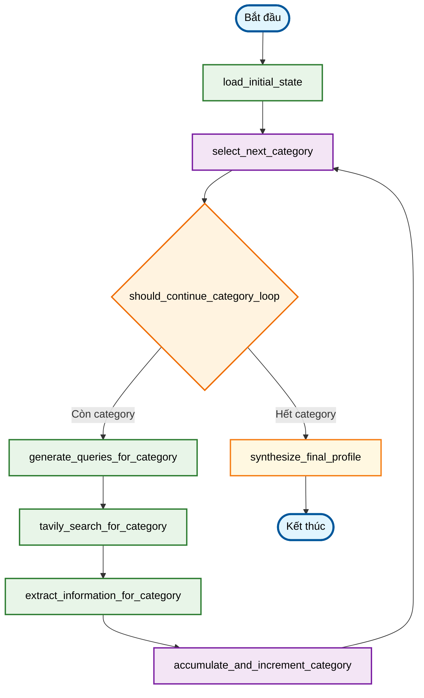

# Deep Researcher Agent - Philosopher Profile Generator 🧠

Một agent AI tiên tiến sử dụng LangGraph để nghiên cứu và tạo ra hồ sơ tri thức toàn diện về các triết gia. Agent này chỉ cần tên của triết gia và sẽ tự động thu thập, xử lý, tổng hợp thông tin từ web để tạo ra báo cáo nghiên cứu có cấu trúc chi tiết theo 8 hạng mục chuyên sâu.

## ✨ Tính năng

- **Nghiên cứu tự động**: Chỉ cần tên triết gia, agent tự động xác định các khía cạnh cần nghiên cứu.
- **Tìm kiếm thông minh**: Tự động tạo và thực hiện các truy vấn tìm kiếm tối ưu dựa trên 8 hạng mục nghiên cứu triết học.
- **Trích xuất thông tin có cấu trúc**: Phân tích và tổ chức thông tin từ nhiều nguồn
- **Tổng hợp tri thức**: Tạo ra hồ sơ triết gia toàn diện và mạch lạc
- **Xử lý đa ngôn ngữ**: Hỗ trợ tiếng Việt và tiếng Anh
- **Lưu trữ kết quả**: Xuất báo cáo dưới định dạng JSON

## 🏗️ Cấu trúc dự án

```
philosopher_research_project/
├── .env_example                  # Template cho biến môi trường
├── requirements.txt              # Danh sách thư viện cần thiết
├── main.py                       # Điểm khởi chạy chính
├── README.md                     # Hướng dẫn sử dụng
└── research_agent/               # Package chính của agent
    ├── __init__.py              # Khởi tạo package
    ├── state.py                 # Định nghĩa state structure
    ├── llm_services.py          # Cấu hình LLM (OpenRouter)
    ├── tool_services.py         # Cấu hình tools (Tavily)
    ├── nodes.py                 # Logic chi tiết cho từng node
    └── graph.py                 # Định nghĩa LangGraph workflow
```

## 🚀 Cài đặt và Thiết lập

### 1. Cài đặt Python packages

```bash
pip install -r requirements.txt
# Đảm bảo bạn đã chạy lệnh này sau khi thêm langchain-groq
```

### 2. Thiết lập API Keys

Tạo file `.env` từ template `.env_example`:

```bash
cp .env_example .env
```

Chỉnh sửa file `.env` và thêm API keys của bạn:

```env
OPENROUTER_API_KEY="your_openrouter_api_key_here" # Có thể bỏ qua nếu chỉ dùng Groq
TAVILY_API_KEY="your_tavily_api_key_here"
GROQ_API_KEY="your_groq_api_key_here"

# Tùy chọn: Chỉ định model
# OPENROUTER_MODEL_NAME="anthropic/claude-3-haiku" 
GROQ_MODEL_NAME="mixtral-8x7b-32768" # Ví dụ: llama3-70b-8192, llama3-8b-8192, gemma-7b-it
```

#### Cách lấy API Keys:

**OpenRouter API Key (Nếu vẫn muốn tùy chọn sử dụng):**
1. Truy cập [OpenRouter.ai](https://openrouter.ai/)
2. Đăng ký tài khoản và tạo API key
3. Sao chép API key vào file `.env`

**Tavily API Key:**
1. Truy cập [Tavily.com](https://tavily.com/)
2. Đăng ký tài khoản và tạo API key
3. Sao chép API key vào file `.env`

**Groq API Key:**
1. Truy cập [GroqCloud Console](https://console.groq.com/keys)
2. Đăng nhập hoặc đăng ký tài khoản.
3. Tạo một API key mới.
4. Sao chép API key và dán vào trường `GROQ_API_KEY` trong file `.env` của bạn.

### 3. Chạy ứng dụng

```bash
python main.py
```

## 🎮 Cách sử dụng

1. **Khởi chạy**: Chạy `python main.py`
2. **Nhập tên triết gia**: Ví dụ: "Plato", "Aristotle", "Immanuel Kant"
3. **Chờ kết quả**: Agent sẽ tự động thực hiện nghiên cứu chi tiết theo 8 hạng mục.
4. **Xem báo cáo**: Hồ sơ triết gia được hiển thị trên console, cấu trúc theo 8 hạng mục.
5. **Lưu file** (tùy chọn): Lưu kết quả dưới định dạng JSON.

## 🔧 Workflow của Agent



### Chi tiết các bước:

1. **Load Initial State**: Khởi tạo trạng thái với thông tin triết gia và chủ đề
2. **Query Generation**: Tạo các truy vấn tìm kiếm tối ưu bằng LLM
3. **Tavily Search**: Thực hiện tìm kiếm web với mỗi truy vấn
4. **Information Extraction**: Trích xuất và cấu trúc hóa thông tin từ kết quả tìm kiếm
5. **Knowledge Synthesis**: Tổng hợp thành hồ sơ triết gia hoàn chỉnh

## 📊 Kết quả đầu ra

Agent tạo ra một hồ sơ triết gia chi tiết, được cấu trúc theo 8 hạng mục chính:

1.  **Thông tin Tiểu sử và Bối cảnh Lịch sử - Văn hóa**
2.  **Các Tác phẩm Chính và Nội dung Cốt lõi**
3.  **Học thuyết và Tư tưởng Triết học Cốt lõi**
4.  **Quan điểm về các Chủ đề Triết học Cụ thể**
5.  **Mối quan hệ và Tương tác Triết học**
6.  **Phê bình và Đánh giá Học thuyết**
7.  **Phương pháp Triết học Đặc trưng**
8.  **Phong cách Lập luận và Văn phong**

Thông tin chi tiết về các trường con trong mỗi hạng mục có thể được xem trong code (đặc biệt là prompts trong `research_agent/nodes.py`).

## ⚙️ Tùy chỉnh

### Thay đổi Model LLM

Agent hiện tại được cấu hình để sử dụng Groq. Bạn có thể thay đổi model Groq mặc định trong file `.env` bằng cách đặt biến `GROQ_MODEL_NAME`.

Ví dụ các model Groq phổ biến:
- `mixtral-8x7b-32768`
- `llama3-70b-8192`
- `llama3-8b-8192`
- `gemma-7b-it`

Nếu bạn muốn chuyển về OpenRouter (hoặc một LLM khác), bạn cần chỉnh sửa `research_agent/llm_services.py` và cập nhật các biến môi trường tương ứng.

### Tùy chỉnh số lượng kết quả tìm kiếm

Chỉnh sửa trong `research_agent/tool_services.py`:

```python
def get_default_search_tool() -> TavilySearchResults:
    return get_tavily_search_tool(max_results=5)  # Thay đổi số lượng ở đây
```

## 🐛 Xử lý lỗi

### Lỗi thường gặp:

1. **Missing API Key**: Kiểm tra file `.env` và đảm bảo `GROQ_API_KEY` (và `TAVILY_API_KEY`) đã được cấu hình đúng.
2. **Network Error**: Kiểm tra kết nối internet
3. **Rate Limit**: Đợi một chút rồi thử lại
4. **Invalid Philosopher Name**: Thử với tên khác hoặc viết rõ ràng hơn

### Debug:

Kiểm tra file log để xem chi tiết lỗi trong `error_messages` của kết quả JSON.

## 📋 Yêu cầu hệ thống

- Python 3.9+
- Kết nối internet ổn định
- API keys hợp lệ cho Groq và Tavily

## 🤝 Đóng góp

Mọi đóng góp đều được hoan nghênh! Hãy tạo pull request hoặc báo cáo issue.

## 📄 License

MIT License - Xem file LICENSE để biết chi tiết.

## 📞 Hỗ trợ

Nếu gặp vấn đề, hãy:
1. Kiểm tra phần troubleshooting ở trên
2. Tạo issue trên GitHub repository
3. Kiểm tra documentation của LangGraph và LangChain

---

**Lưu ý**: Agent này sử dụng AI để tổng hợp thông tin từ web. Hãy luôn kiểm tra và xác minh thông tin từ các nguồn đáng tin cậy trước khi sử dụng cho mục đích học thuật hoặc nghiên cứu. "# talkWithPhilosopher" 
